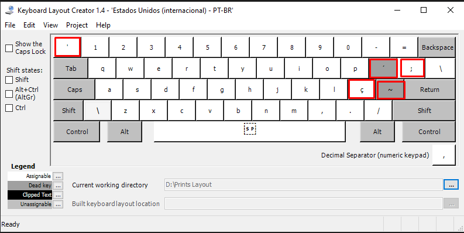
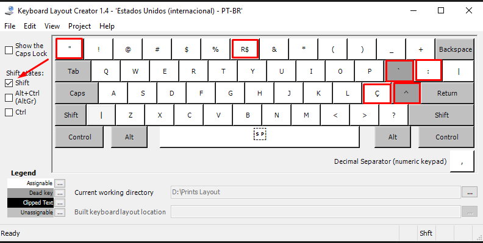
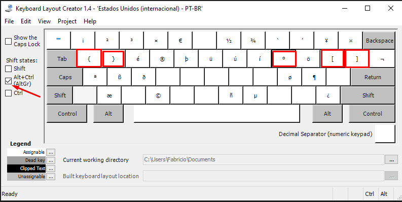
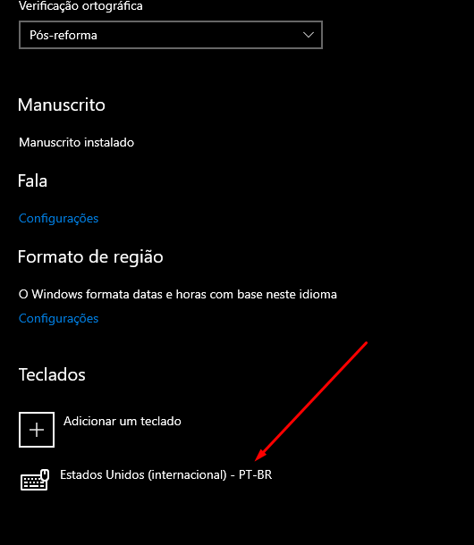

# Layout ANSI para pt-BR

Para criar o layout novo foi utilizado o programa da Microsoft **[Microsoft Keyboard Layout Creator](https://www.microsoft.com/en-us/download/details.aspx?id=102134)**

O arquivo zip "layout-keyboard-eua-pt_br.zip" contem o executável para instalação do Layout.

O arquivo "eng-internacional-pt_br.klc" é o arquivo utilizado pelo programa Microsoft Keyboard Layout Creator que utilizei para gerar o executável.

## Novo Layout Customizado

